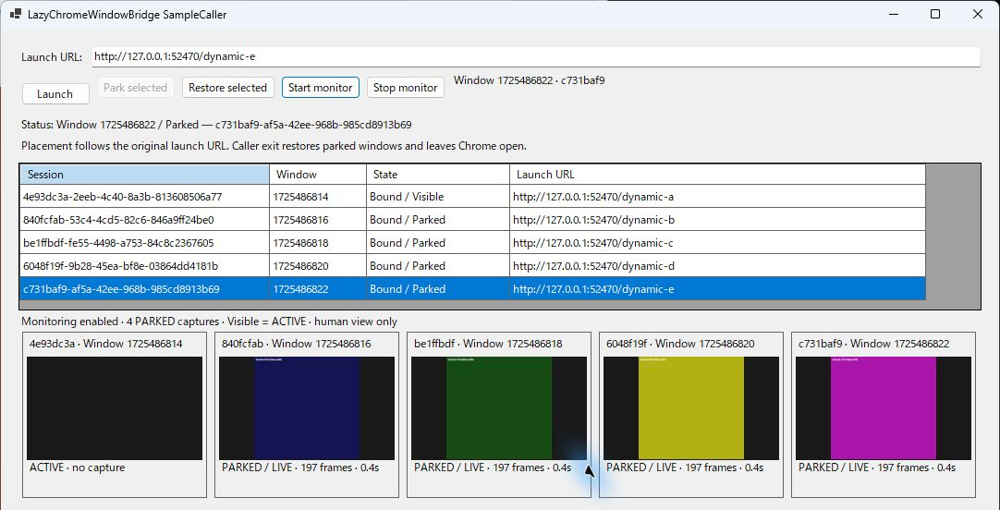
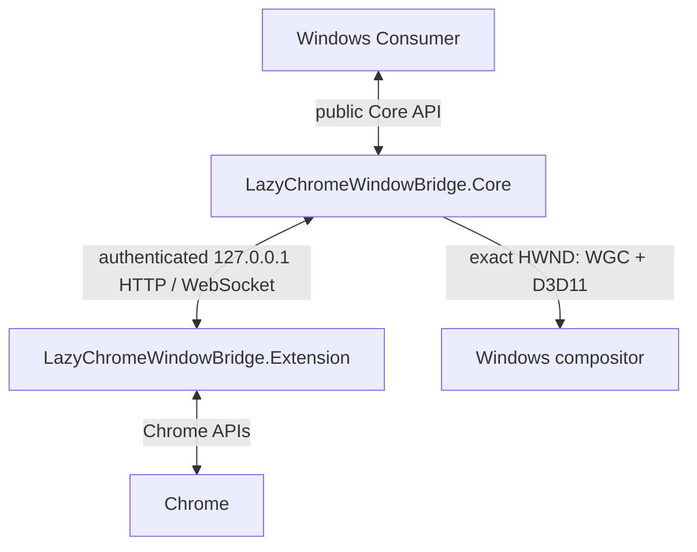

# LazyChromeWindowBridge

**Control the Chrome window, not the webpage.**

A Windows-to-Chrome bridge for deterministic session/window ownership, native geometry,
full offscreen PARK/RESTORE, lightweight human monitoring, manual window control and
Chrome Download Manager lifecycle events — without DOM automation.



*Historical v0.1.0 screenshot using isolated neutral fixtures. Public 0.2.0 added
continuous Visible/Parked BrowserViewport preview and per-session pause/resume. The
accepted 0.3.0 runtime adds NativeWindow capture and taskbar controls, which this
historical image does not demonstrate.*

Built for .NET Windows applications that need Chrome window management and browser
integration through a Manifest V3 extension. Unlike DOM-oriented browser automation
tools, it works with Chrome application/window state and exact native ownership.
Licensed under [MIT](LICENSE). This is an early release, with explicit [support limits](docs/limitations.md).

**Current release v0.3.2 is published:** [GitHub v0.3.2](https://github.com/Yasuhiko-m/LazyChromeWindowBridge/releases/tag/v0.3.2) provides the matching Extension ZIP and Windows bundle, and Core 0.3.2 was published through the successful immutable-tag NuGet OIDC workflow. v0.3.2 adds one bounded, allowlisted key/chord request to the exact owned active tab. Completion confirms bounded CDP `Input.dispatchKeyEvent`, not a page or Chrome-UI effect; it is not arbitrary JavaScript, text macros, click automation, DOM automation, or general remote control.

## Version matching / Chrome Web Store availability

The extension is a developer companion, not a standalone browser app: by itself it has
no standalone dashboard or user workflow. It works only with a matching
LazyChromeWindowBridge Windows/Core companion and its authenticated owned sessions; it
does not discover, take over, monitor, or control arbitrary Chrome windows or tabs.

Use matching Core and Extension versions. Chrome Web Store review can make an update
available later than GitHub/NuGet, and LCWB does not guarantee every GitHub/NuGet version
will be submitted to or published on CWS. GitHub Releases are the exact-version fallback
when CWS is behind or skips a version: download
`LazyChromeWindowBridge.Extension-<version>-cws.zip` from the matching release, extract
it, open `chrome://extensions`, enable **Developer mode**, choose **Load unpacked**, and
select the extracted directory containing `manifest.json`. This path does not depend on
CWS review or availability.

**v0.3.2:**
adds bounded `BrowserKey` / `BrowserKeyModifiers` / `BrowserKeyChord` dispatch through
`SendKeyChordAsync` for the exact owned active tab only. It remains one fixed CDP
keyDown/keyUp operation, not a macro or general input/automation facility. CWS 0.3.2 is
submitted and pending review; CWS 0.2.0 remains the current general-public Store build
and does not match 0.3.2. Use the matching GitHub Extension ZIP through **Developer mode**
/ **Load unpacked** until Google approval/publication.
See the [0.3.2 release notes](docs/releases/v0.3.2.md).

**v0.3.1:**
contains the Chrome launch policy, capture-region/resize/source-size, and
preview-liveness work. It keeps the accepted NativeWindow/taskbar runtime and
R015 caller-controlled Chrome launch switches, and refines monitoring with
natural-source `CaptureRegion` selection, explicit `CaptureResize`, and pre-monitor
`GetCaptureSourceSizeAsync`. BrowserViewport now takes a natural PNG without CDP clip or
scale, processes region/resize in the extension, and sends only final JPEG. NativeWindow
crops/resizes on its WGC/D3D11 path before CPU readback. LCWB now includes
`--disable-backgrounding-occluded-windows` by default so owned windows PARKed fully
offscreen retain Chrome rendering where Chrome honors that switch. Set
`BridgeOptions.PreserveBackgroundRendering` to false to omit only that default, or use
`AdditionalChromeArguments` / repeatable `--chrome-argument` for allowed caller switches.
`--load-extension=<directory>` is useful with Chrome for Testing/Chromium; branded
Chrome support is not promised. Use matching Core and Extension versions. CWS 0.2.0 is
general-public but does not match Core/Extension 0.3.x.
See the [0.3.1 release notes](docs/releases/v0.3.1.md).

## What it does
- Launch independent Chrome windows, including several with the same launch URL.
- Retain deterministic appSessionId ↔ Chrome WindowId ↔ native HWND/PID/property identity.
- Keep Chrome session binding independent of navigation and active-tab changes.
- Persist Chrome window position and size by the original launch URL; set manual bounds.
- PARK a window fully outside all monitors and RESTORE its protected Normal bounds.
- Read state/bounds and set a Visible window's physical-pixel placement.
- Monitor all eligible Visible and Parked sessions independently as BrowserViewport or exact-HWND NativeWindow JPEGs.
- Hide/show only one owned HWND in the taskbar without changing placement or monitoring.
- Dispatch one structured allowlisted key/chord to the exact owned active tab; completion
  confirms fixed CDP dispatch, not page or Chrome-UI handling.
- Observe profile-global Created / Complete / Interrupted downloads once per Bridge.

## What it intentionally does not do
- DOM scraping or Runtime.evaluate.
- OCR, semantic image analysis or page-content analysis.
- Arbitrary click/input, text macros, scripting, or remote webpage control.
- ChatGPT output/completion extraction or other webpage completion detection.
- Network response inspection, session recording or cloud relay.

Chrome download lifecycle is browser metadata, not a webpage completion signal.
The monitor is a small human status overview, not remote desktop or video streaming.

## Architecture


This Chrome extension native bridge uses the existing loopback listener rather than a
native-messaging host installation. Core owns the Win32 Chrome window mapping;
the consumer owns presentation and filesystem decisions.

| Component | Responsibility |
| --- | --- |
| `src/LazyChromeWindowBridge.Core` | Public `BridgeRuntime` API, ownership, loopback transport, native geometry and encoded thumbnails |
| `src/LazyChromeWindowBridge.Extension` | MV3 binding/recovery, debugger viewport capture and read-only download observation |
| `samples/LazyChromeWindowBridge.SampleCaller` | WinForms example using only the public Core API |
| `tests/` | Core, external public-API consumer and extension checks |

Core has no WinForms/WPF UI type dependency. Its bounded JPEG decoding uses the
built-in Windows Desktop GDI+ imaging runtime. SampleCaller owns PictureBox/Zoom.

## Requirements
- Windows desktop session supported by .NET 10, with an interactive display.
- NativeWindow specifically requires Windows 10 version 1903 (build 18362) or later and a D3D11/WGC-capable device; BrowserViewport remains in the `net10.0-windows` package asset.
- .NET 10 SDK for development (includes the required build/targeting components).
- Runtime deployments need .NET 10, ASP.NET Core and Windows Desktop shared runtimes.
- Google Chrome 120+ with the unpacked extension enabled in the same profile.
- PowerShell 7 and Node.js 22+ for validation.
- Chrome for Testing with extension loading support for isolated browser acceptance.

No third-party NuGet or npm packages are required.

## Quick start
Run from the repository root:

```powershell
dotnet restore .\LazyChromeWindowBridge.sln
dotnet build .\LazyChromeWindowBridge.sln --no-restore
```

In Chrome, open `chrome://extensions`, enable Developer mode, select **Load unpacked**
and choose `src/LazyChromeWindowBridge.Extension`. Review the requested permissions:
storage, alarms, debugger, downloads and IPv4 loopback host access. The broad downloads
permission is used only for official event observation and lookup by download ID.

```powershell
dotnet run --project .\samples\LazyChromeWindowBridge.SampleCaller
```

SampleCaller discovers installed Chrome. To choose an executable/profile explicitly:

```powershell
dotnet run --project .\samples\LazyChromeWindowBridge.SampleCaller -- `
  --chrome-executable "$env:ProgramFiles\Google\Chrome\Application\chrome.exe"
```

The optional `--chrome-user-data-dir` and `--geometry-directory` arguments accept
ordinary paths; use a dedicated test profile for acceptance. Repeat
`--chrome-argument <switch>` for allowed additional Chrome switches, for example
`--chrome-argument "--load-extension=C:\\cft-extension"`. LCWB rejects caller attempts
to replace its ownership/profile/bootstrap flags. Do not attach debugger tooling to a
profile containing unrelated personal sessions for these tests.

Enter a launch URL and click Launch. Wait for Bound / Visible, choose BrowserViewport
or NativeWindow, then Start monitor.
Every eligible Visible window supplies a LIVE JPEG tile. Park or Restore a session:
its preview continues with the same monitor generation and attachment. Change FPS /
JPEG max width / height and click Apply preview to update without restarting.
Select a session and Pause preview to freeze its last JPEG while peers remain LIVE.
Resume preview restarts only that session. **The caller owns monitoring policy:
PARK/RESTORE never automatically switches Monitor ON/OFF.** Paused sessions remain
paused across placement and global option updates. Their frame number and captured
timestamp stay fixed; the sample displays a frozen marker instead of an updating age.
PARK/RESTORE controls native window placement only; it does not automatically start,
stop, pause or resume monitoring. The Caller explicitly chooses per-session monitoring
with `SetSessionMonitoring(appSessionId, enabled)`.
Hide from taskbar / Show in taskbar changes only the selected owned HWND. That runtime
policy survives PARK/RESTORE and monitor changes and is restored on normal disposal.
Stop monitor stops every capture and clears previews; Start reuses the control sockets.
Global Start after Stop is a batch restart that enables all live sessions again.
Closing SampleCaller normally restores PARKED windows and leaves Chrome open.

## Integrating Core
Reference `src/LazyChromeWindowBridge.Core/LazyChromeWindowBridge.Core.csproj` from
a `net10.0-windows` application for BrowserViewport compatibility, or target
`net10.0-windows10.0.18362.0` or later to use NativeWindow. The sample is not a library dependency.

```csharp
using LazyChromeWindowBridge.Core;

await using var bridge = await BridgeRuntime.StartAsync(BridgeOptions.Parse([]));
var session = await bridge.LaunchAsync("https://example.com/");

// In your application's UI/timer, wait until GetWindow(id) reports Visible.
var window = bridge.GetWindow(session.AppSessionId);
if (window?.State == PlacementState.Visible)
{
    bridge.StartMonitoring(new CaptureOptions(2, 240, 135, CaptureMode.NativeWindow));
    bridge.SetShowInTaskbar(session.AppSessionId, false); // Independent exact-HWND policy.
    bridge.Park(session.AppSessionId);
    // On later UI ticks: bridge.GetLatestFrame(id)?.Jpeg supplies encoded bytes.
    bridge.Restore(session.AppSessionId);  // Same owned window, protected Normal.
}
```

Binding is asynchronous. See [Integration](docs/integration.md) for a complete bounded
wait, manual bounds, frame consumption and shutdown. A missing extension is reported
as a session failure, not a different target selection.

## PARK and monitoring
For Chrome multi-window workloads, PARK is explicit logical state and native placement outside every monitor; it is not
minimization. Normal is protected while PARKED. Manual SetWindowBounds requires a
Visible session; Restore first if it is PARKED. Coordinates are physical pixels,
including reachable negative-coordinate monitors.
This Windows Chrome integration supports multi-monitor layouts and negative coordinates.
An offscreen Chrome window retains its full native size: PARK/RESTORE browser window
management does not minimize it or use experimental native shrinking.

Default monitoring is **2 fps, maximum 240×135, JPEG quality 70**, with preserved aspect
ratio and no capture upscale. Requests accept 1–30 fps; roughly 2–30 is recommended.
The maximum is a request ceiling, not a promise of measured 30fps. Five mixed Visible/
Parked streams form the accepted validation workload. Native shrinking was rejected; the native window
keeps its normal size while only the captured image is scaled.

`CaptureMode.BrowserViewport` is the default and preserves the 0.2.0 CDP path.
`CaptureMode.NativeWindow` creates a Windows Graphics Capture item directly from the
validated owned HWND—without a picker, foreground activation or debugger capture.
Its full-window composition may include title bar and border. D3D11 crops to the WGC
ContentSize and resizes without upscale before bounded CPU readback and JPEG encoding.
NativeWindow frames use `TabId == -1` because active-tab identity is not applicable;
`AppSessionId`, `NativeIdentity`, `WindowId`, `Generation` and `Mode` remain authoritative.
Mode changes advance acquisition generations; same-mode FPS/size changes stay in place.

Chrome's debugger permission is broad for BrowserViewport, although that path only uses
Page.getLayoutMetrics and Page.captureScreenshot. LCWB-launched Chrome includes
`--silent-debugger-extension-api` for best-effort infobar suppression on supported Chrome.
Visual infobar absence was not established in acceptance and is not guaranteed.
This is Chrome behavior, not the extension removing warnings or weakening debugger
permission. Chrome may ignore the flag and show a notice; capture does not depend on
suppression. An already-running profile can retain its original process flags.
Cancellation is respected; explicit Start is required to retry a canceled monitor.
BrowserViewport can attach Chrome's debugger while either Visible or Parked. Placement and
option changes keep that same-tab attachment. JPEG bounds never change viewport or zoom.
Chrome window control remains
limited to the owned native window and explicit consumer commands.

## Download lifecycle
The Chrome downloads API supplies this read-only Chrome download lifecycle stream.
Subscribe to `BridgeRuntime.DownloadChanged` before launching sessions. Events contain
`DownloadId`, `State`, exact Chrome `Filename`, optional `Error` and `ObservedAt`.
There is no appSessionId or URL attribution: downloads belong to the Chrome profile.
Five bound sessions in one Bridge still receive one lifecycle stream. `GetDownloads()`
and `GetDownload(id)` expose bounded current runtime snapshots.

Chrome Complete is the completion authority. The consumer must validate the expected
directory/name, existence, stable size/time and exclusive access before moving a file.
Core never opens or moves it. Handlers run synchronously and must return promptly;
queue filesystem/UI work in the consumer. Absolute filenames are sensitive: do not
log them. See [Download lifecycle](docs/downloads.md) for recovery and capacity limits.

## Validation
```powershell
# Clean build + deterministic Core/public API/extension checks.
.\Scripts\Test-All.ps1 -Clean

# Complete real browser/native/five-session acceptance (set your CfT path).
.\Scripts\Test-All.ps1 -ChromeExecutable $chromeForTesting

# Interactive sample fixture with isolated local pages.
.\Scripts\Test-All.ps1 -ChromeExecutable $chromeForTesting -Gui
```

Each invocation writes one disposable log under `Scripts/Outputs`. Without
`-ChromeExecutable`, the entry explicitly reports that real browser tests were skipped.
See [Testing](docs/testing.md) for coverage and evidence boundaries.

## Further reading
- [Architecture](docs/architecture.md)
- [Integration/API](docs/integration.md)
- [Download lifecycle](docs/downloads.md)
- [Security and privacy](docs/security.md)
- [Limitations](docs/limitations.md)
- [Testing](docs/testing.md)
- [Product and governance identity](docs/identity.md)
- [First-release notes](docs/releases/v0.1.0.md)
- [Release packaging and maintainer steps](docs/github-release.md)

## Development

Lazy AI Deck was used as the development orchestration environment.
LazyChromeWindowBridge itself has no runtime dependency on Lazy AI Deck.

Lazy AI Deck is a consumer of this independent product, not its runtime container.
Pre-release geometry data from the former product is not a supported migration
contract; see the identity and limitations notes.
