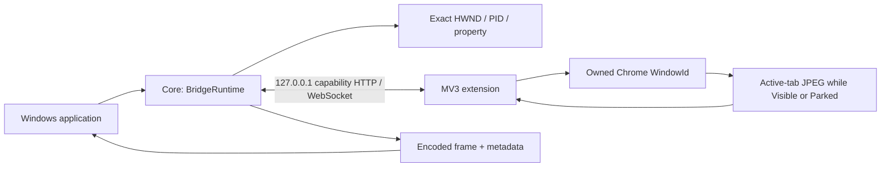
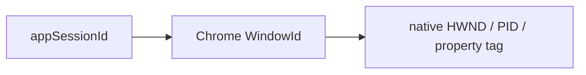

# Architecture

Core runs in the consuming Windows application. It owns an ephemeral IPv4 loopback
Kestrel listener; the extension operates in the selected Chrome profile. The sample
is a separate WinForms application and can be replaced by another public-API consumer.

## Ownership and launch
Each launch receives a random appSessionId and an independent 256-bit capability.
Two launches of the same URL remain distinct. The fragment-bearing local bootstrap
is restricted to `/lazy-chrome-window-bridge/bootstrap`. The extension verifies the
sender, top frame, exact URL/path and capability shape, then obtains Chrome IDs from
the sender rather than searching by page title or URL.

The caller binds a session to one browserSessionId/windowId tuple. A one-time native
marker, `LazyChromeWindowBridge Session <id>`, maps that bootstrap window to its HWND.
The PID and `LazyChromeWindowBridge.SessionBinding` property must continue to match.
Native mapping is acknowledged before navigating to the launch URL. Later navigation
and active-tab changes do not reselect the owned window.

This chain is window ownership only. Profile-global downloads have no appSessionId
association; see the separate [download lifecycle](downloads.md).

## Geometry
`WindowSnapshot` carries physical current bounds, remembered Normal, placement state,
DPI, identity and the original launch/profile URL. Persistence uses a hashed normalized
launch URL under `%LOCALAPPDATA%\LazyChromeWindowBridge\Geometry`; query and fragment
remain profile distinctions.

The stable Visible observer saves Normal after a debounce. PARK retains Normal and
moves the exact native window above the topmost display with a bounded margin. It
never persists offscreen coordinates or experimental small dimensions. Restore
checks ownership again, restores Normal or a deterministic reachable topology fallback,
and returns actual bounds. Manual Set is Visible-only and uses the same checked move.
Each placement transition advances a generation.

## Monitoring and presentation
Global monitoring requests every eligible live owned Visible or Parked session independently. Per-session
entries retain a connection, generation, native identity, latest JPEG, counters and
error. Either placement can have a monitoring debugger attached and receive fresh JPEGs.
Monitor state and native placement are separate. Current Source is Chat-accepted
V1-M005-R011 in the combined R011 checkpoint; published 0.1.0 retains the earlier contract.

The extension queries only the active tab of the already-owned window. It uses
Page.getLayoutMetrics and Page.captureScreenshot, one acquisition per target at a
time, bounded to five seconds. Generations, socket backlog limits and bounded image
sizes reject obsolete or excessive frames. The caller checks session/window/native/
connection/generation before and after decode. One target's failure does not stop peers.

Core supplies a `MonitorFrame` with read-only encoded memory. SampleCaller uses
PictureBox Zoom, independent ~200–300px tiles, a 33ms preview poll and 500ms session refresh. A bitmap is
replaced only for a new frame; the preview does not deliberately blank between frames.
Stopped, failed or invalidated requests clear obsolete pixels. Placement does not.
Explicit session pause is the exception: it advances only the target generation to
reject in-flight frames, keeps the exact latest JPEG, and exposes Paused instead of Live.
The caller owns policy; PARK/RESTORE never automatically switches Monitor ON/OFF.
Session ON reuses the waiting socket and returns Waiting then Live; peers are unaffected.

## Lifetime
Park/Restore preserves the monitor generation, latest JPEG, socket and same-tab debugger.
StartMonitoring(options) while enabled signals an in-place update. The pump wakes and
uses new options at its next practical iteration, retaining any already acquired frame.
It preserves explicit per-session OFF. Only global stopped-to-started is batch ON for
all live sessions. Session control during global Stop rejects without starting capture.
Requests allow 1–30 fps (default2); output bounds default240×135, fixed quality70,
aspect-preserving and no upscale. Native size, viewport and zoom are unaffected.
30fps is a request ceiling, not a performance promise.
Closing an attached tab permits same-window active-tab reacquisition. User cancellation
remains blocked until an explicit new generation. Worker recovery cleans persisted
owned debugger targets and reconnects currently eligible requests.

Stop clears previews and stops frame traffic/debugger capture. Idle control sockets
remain for Start; CapturingConnections is zero, while Connections may remain nonzero.

Normal async disposal stops monitoring, waits up to seven seconds for connection/
debugger cleanup, restores protected Normal geometry and stops the loopback server.
It leaves Chrome open. Forced process termination cannot perform this sequence.
ChromeLauncher includes --silent-debugger-extension-api in its structured launch
arguments. Chrome-dependent infobar suppression is best effort; permissions and the
production two-command debugger allowlist are unchanged if a notice is suppressed.
If Chrome ignores the flag or reuses a process with old flags, monitoring still works.

## Download observation
Official Chrome download events feed a bounded storage.session outbox. Grouping by
exact Bridge ID/origin selects one live capability, independent of the number of
bound windows. Sequential authenticated HTTP reports use the existing listener.
A monotonic browser-session sequence and Core high-water mark make retries idempotent;
per-destination acknowledgements allow independent Bridges to recover separately.
BridgeRuntime publishes immutable profile-global events and bounded latest snapshots.
No session attribution or file access is performed. See [Download lifecycle](downloads.md).
