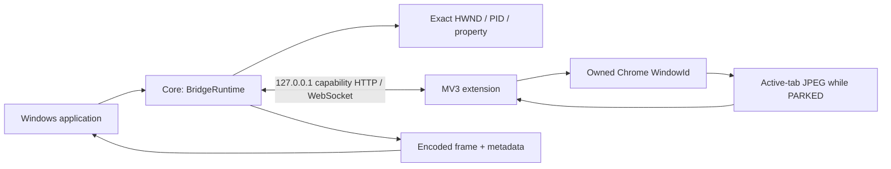

# Architecture

Core runs in the consuming Windows application. It owns an ephemeral IPv4 loopback
Kestrel listener; the extension operates in the selected Chrome profile. The sample
is a separate WinForms application and can be replaced by another public-API consumer.

## Ownership and launch
Each launch receives a random appSessionId and an independent 256-bit capability.
Two launches of the same URL remain distinct. The fragment-bearing local bootstrap
is restricted to `/lazy-chrome-window-bridge/bootstrap`. The extension verifies the
sender, top frame, exact URL/path and capability shape, then obtains Chrome IDs from
the sender rather than searching by page title or URL.

The caller binds a session to one browserSessionId/windowId tuple. A one-time native
marker, `LazyChromeWindowBridge Session <id>`, maps that bootstrap window to its HWND.
The PID and `LazyChromeWindowBridge.SessionBinding` property must continue to match.
Native mapping is acknowledged before navigating to the launch URL. Later navigation
and active-tab changes do not reselect the owned window.

## Geometry
`WindowSnapshot` carries physical current bounds, remembered Normal, placement state,
DPI, identity and the original launch/profile URL. Persistence uses a hashed normalized
launch URL under `%LOCALAPPDATA%\LazyChromeWindowBridge\Geometry`; query and fragment
remain profile distinctions.

The stable Visible observer saves Normal after a debounce. PARK retains Normal and
moves the exact native window above the topmost display with a bounded margin. It
never persists offscreen coordinates or experimental small dimensions. Restore
checks ownership again, restores Normal or a deterministic reachable topology fallback,
and returns actual bounds. Manual Set is Visible-only and uses the same checked move.
Each placement transition advances a generation.

## Monitoring and presentation
Global monitoring requests every eligible PARKED session independently. Per-session
entries retain a connection, generation, native identity, latest JPEG, counters and
error. An authenticated control socket may remain for a Visible session, but it
receives disabled capture control and no monitoring debugger attaches.

The extension queries only the active tab of the already-owned window. It uses
Page.getLayoutMetrics and Page.captureScreenshot, one acquisition per target at a
time, bounded to five seconds. Generations, socket backlog limits and bounded image
sizes reject obsolete or excessive frames. The caller checks session/window/native/
connection/generation before and after decode. One target's failure does not stop peers.

Core supplies a `MonitorFrame` with read-only encoded memory. SampleCaller uses
PictureBox Zoom, independent ~200–300px tiles and a 500ms UI refresh. A bitmap is
replaced only for a new frame; the preview does not deliberately blank between frames.
Visible, stopped, failed or invalidated requests clear obsolete pixels.

## Lifetime
Restore invalidates pixels and wakes capture control promptly; an in-flight frame
may finish but cannot be accepted. Re-PARK starts a new generation of the same session.
Closing an attached tab permits same-window active-tab reacquisition. User cancellation
remains blocked until an explicit new generation. Worker recovery cleans persisted
owned debugger targets and reconnects currently eligible requests.

Normal async disposal stops monitoring, waits up to seven seconds for connection/
debugger cleanup, restores protected Normal geometry and stops the loopback server.
It leaves Chrome open. Forced process termination cannot perform this sequence.
